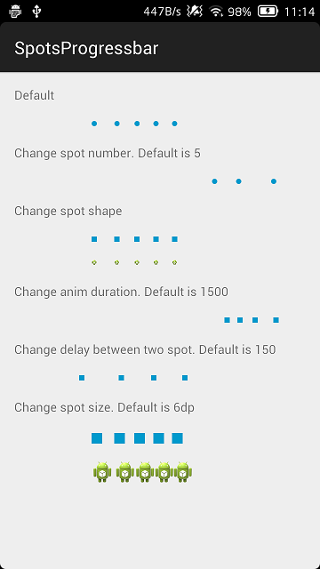

# SpotsProgressbar
A progressbar like win8 but it is horizon.
==================================================================
##Current work
  
==================================================================
##Usage
**Note:** The library requires minimum API level 11.

**Include the library to your project.**

in layout.xml file 
```xml
    <com.deekea.spotsprogressbar.library.SpotsProgressbar
        android:layout_width="match_parent"
        android:layout_height="wrap_content"
        android:layout_gravity="center"/>
```
==================================================================
##Customization
Provide you own style resource:
```xml
<?xml version="1.0" encoding="utf-8"?>
  <resources>
      <declare-styleable name="SpotsProgressbar">
          <attr name="sp_spot_shape" format="reference"/>
          <attr name="sp_spot_size" format="dimension|integer"/>
          <attr name="sp_spot_count" format="integer"/>
          <attr name="sp_duration" format="integer"/>
          <attr name="sp_delay" format="integer"/>
      </declare-styleable>
  </resources>
```
For example to change the spot shape :
```xml
    <com.deekea.spotsprogressbar.library.SpotsProgressbar xmlns:sp="http://schemas.android.com/apk/res-auto"
        sp:sp_spot_shape="@drawable/spot_rec"
        android:layout_width="match_parent"
        android:layout_height="wrap_content"
        android:layout_gravity="center"/>
```
==================================================================
##Thanks
spots-dialog, https://github.com/d-max/spots-dialog<br>
ProgressBar, https://github.com/wly2014/ProgressBar<br>

I just pick up some java file from spots-dialog and ProgressBar project and make spotsprogressbar like a view which add anywhere.
